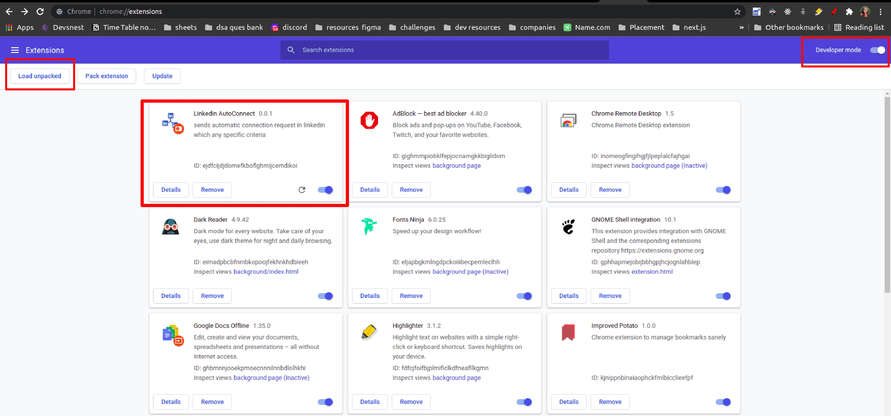
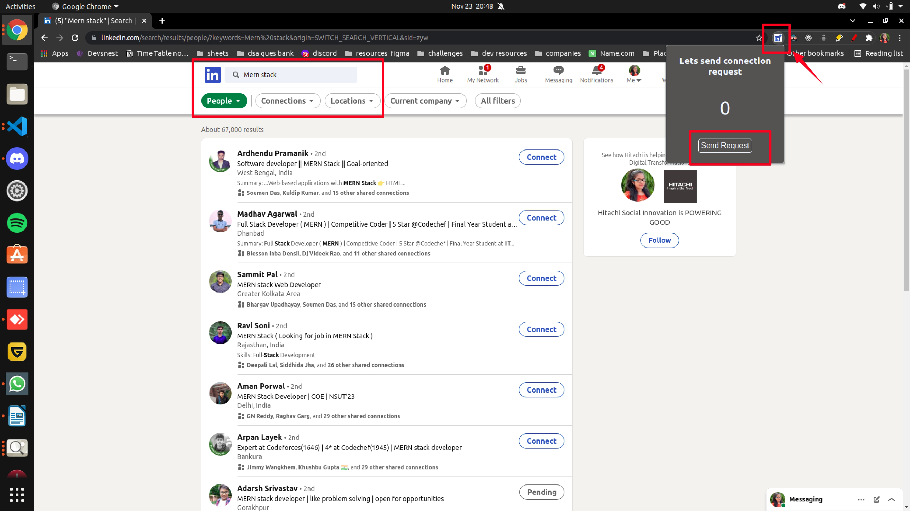

# LinkedIn AutoConnect - Chrome Extension

This extensions is for every LinkedIn user who is tired of manually clicking 'Connect' button to send connection request, when they can do the same with just one click.

## Install

1. Download `auto-connection-request-extension-main.zip` from the [LinkedIn AutoConnect](https://github.com/knshika/auto-connection-request-extension/archive/refs/heads/main.zip) and unzip it.
2. Open Google Chrome, type `chrome://extensions` on your address bar and hit Enter.
3. On the Chrome Extensions page, check the `Developer mode` box. New buttons will be displayed.
4. Click on the button `Load unpacked`.
5. Navigate to the unzipped extension folder, select it and click 'Open'.
6. The extension should now be loaded and enabled on Chrome, and you can use it by clicking the LinkedIn AutoConnect extension icon.
7. Don't forget to pin it for quick access.

## Usage

1. Open your LinkedIn page whom you want to connect with or go to [Search People](https://www.linkedin.com/search/) and specify people .
2. Now click the extension icon in the loaded page and it will now start connecting to people automatically.
3. You can see the counts of request send , so enjoy using it and connect to more people .
